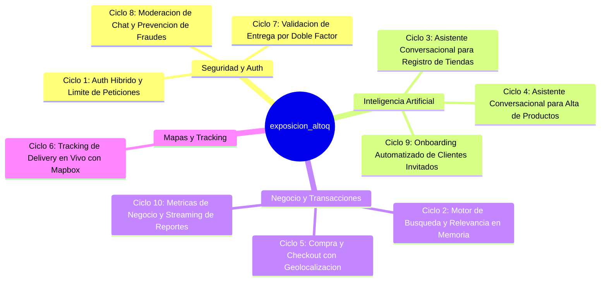
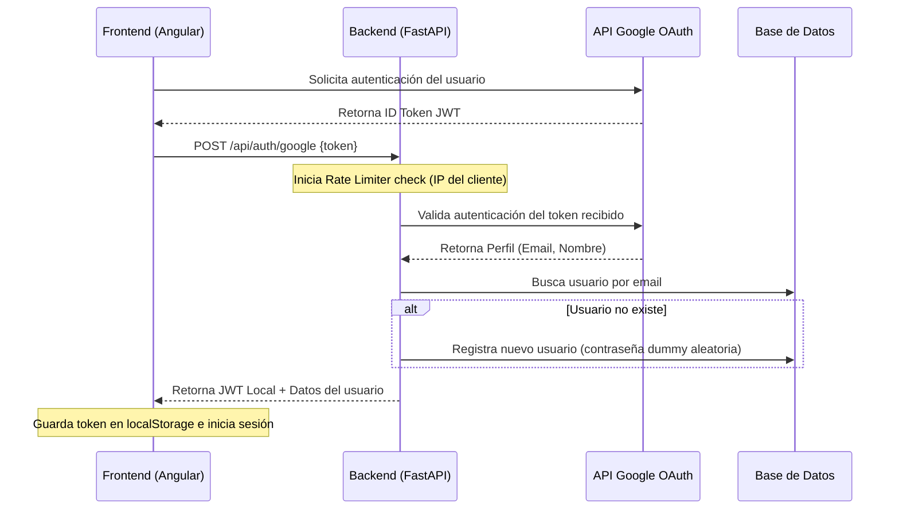
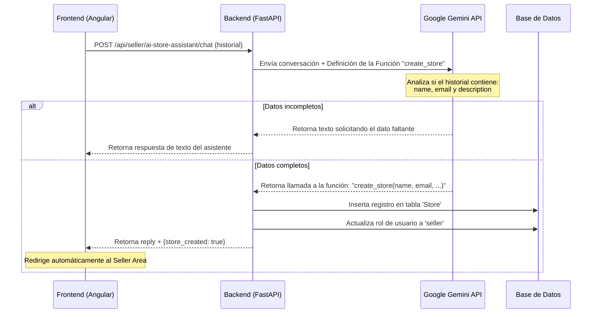
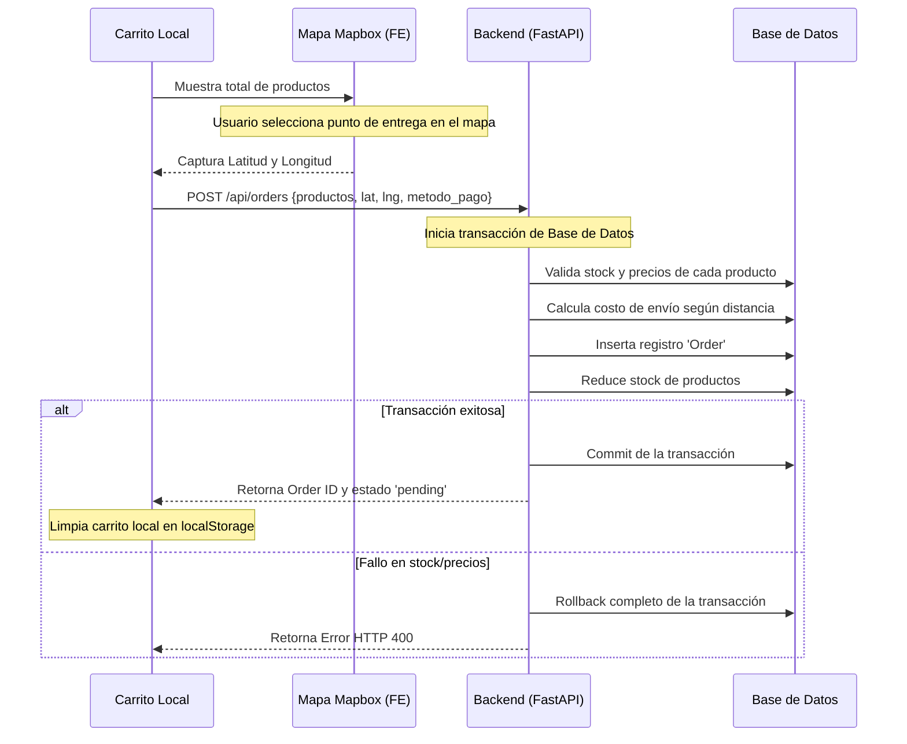
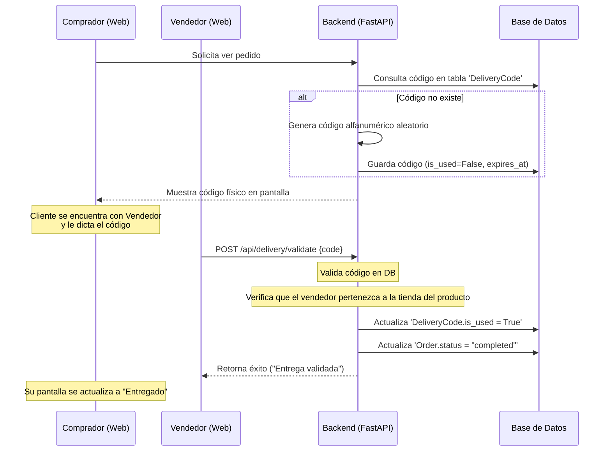
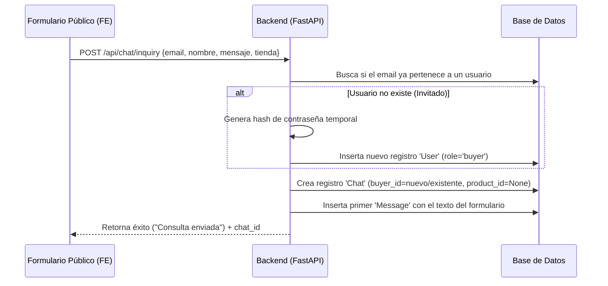

# Guía de Exposición: 10 Ciclos de Proceso Completos (E-Commerce AltoQ)

Este documento ha sido diseñado específicamente para servir como guía y material de apoyo en una exposición universitaria. En lugar de dividir el proyecto por módulos convencionales (como "base de datos" o "vistas"), el proyecto se analiza a través de **10 Ciclos de Exposición Completos**. Cada ciclo representa un caso de uso de inicio a fin (End-to-End), mostrando la interacción entre el Frontend (Angular), la API (FastAPI), la Base de Datos (SQLAlchemy) y servicios de terceros (Google Gemini, Mapbox).

---

## 🏗️ Resumen de la Arquitectura del Sistema

Antes de exponer los ciclos, es útil presentar la arquitectura base:
*   **Patrón Arquitectural**: Cliente-Servidor Desacoplado.
*   **Frontend**: SPA reactiva construida en Angular con componentes independientes (*standalone*). Usa interceptores HTTP para gestionar sesiones.
*   **Backend**: API REST asíncrona en FastAPI. Usa el sistema de inyección de dependencias (`Depends`) de FastAPI para gestionar sesiones de bases de datos y seguridad.
*   **Capa de Persistencia**: Mapeador objeto-relacional (ORM) SQLAlchemy 2.0. Base de datos SQLite (en desarrollo) o PostgreSQL (en producción) con migraciones incrementales gestionadas por Alembic.

---

## 🔄 Los 10 Ciclos de Exposición



---

### 🔑 Ciclo 1: Autenticación Híbrida con Google OAuth2 y Rate Limiting

#### A. Lógica de Negocio
Controla el acceso seguro al sistema. Permite a los usuarios registrarse/iniciar sesión de forma tradicional o mediante su cuenta de Google. Protege los endpoints de autenticación contra ataques de fuerza bruta (registro y login masivos) utilizando un limitador de frecuencia (*Rate Limiter*).

#### B. Flujo Paso a Paso


#### C. Explicación Técnica del Código
*   **Frontend**: `login.ts` captura las credenciales o el token de Google y llama a `AuthService.login()` o `AuthService.googleLogin()`. El interceptor [auth.interceptor.ts](file:///c:/Users/dakho/Documents/altoq/altoq_frontend/src/app/interceptors/auth.interceptor.ts) captura cada petición HTTP saliente e inyecta la cabecera `Authorization: Bearer <token>`.
*   **Backend - Rate Limiting**: En [security.py](file:///c:/Users/dakho/Documents/altoq/altoq_backend/app/utils/security.py), se define `InMemoryRateLimiter` que mapea IPs a marcas de tiempo. En [auth.py](file:///c:/Users/dakho/Documents/altoq/altoq_backend/app/routes/auth.py), los endpoints `/register` y `/login` verifican al cliente mediante:
    ```python
    if not login_rate_limiter.is_allowed(client_ip):
        raise HTTPException(status_code=429, detail="Demasiados intentos...")
    ```
*   **Backend - Autenticación con Google**: El endpoint `/api/auth/google` en [auth.py](file:///c:/Users/dakho/Documents/altoq/altoq_backend/app/routes/auth.py) valida el token externamente con `id_token.verify_oauth2_token()`. Si el usuario no existe, crea un registro en el modelo `User` con una contraseña segura aleatoria (`secrets.token_urlsafe(16)`).

#### D. Valor para la Exposición
Demuestra el manejo de **integración de APIs externas (OAuth2)**, el control de seguridad preventivo (**Rate Limiting en memoria**) y el almacenamiento de sesiones en el cliente.

---

### 🔍 Ciclo 2: Motor de Búsqueda y Algoritmo de Relevancia en Memoria

#### A. Lógica de Negocio
El cliente escribe palabras clave en la barra de búsqueda. El sistema busca productos que contengan dichas palabras en su título o descripción y los ordena no por ID, sino por **relevancia de coincidencia**, asegurando que los resultados más exactos aparezcan primero.

#### B. Flujo Paso a Paso
1.  El usuario escribe `"zapatillas running"` en el input de búsqueda de la barra de navegación de Angular.
2.  El componente redirige a `/search?q=zapatillas+running`.
3.  `SearchResultsComponent` llama a `ProductService.searchProducts("zapatillas running")`, que hace un GET a `/api/products/search?q=...`.
4.  El backend tokeniza la consulta en palabras individuales `["zapatillas", "running"]`.
5.  Se ejecuta una consulta SQL con filtros `ilike` combinados con un operador `and_` para traer productos que contengan **todas** las palabras.
6.  El backend calcula un **Score** de relevancia en memoria para cada producto coincidente.
7.  Se ordena la lista de productos de mayor a menor puntaje, se calculan las ventas de cada uno (`_populate_product_sales`) y se envían paginados al frontend.

#### C. Explicación Técnica del Código
En [products.py](file:///c:/Users/dakho/Documents/altoq/altoq_backend/app/routes/products.py) (líneas 39-102), el algoritmo calcula la relevancia acumulando puntos según criterios específicos:
```python
score = 0
# 1. Coincidencia exacta de la frase en el nombre del producto (+1000 a +1500 pts)
if q_lower in name_lower:
    score += 1000
    if name_lower == q_lower:
        score += 500

# 2. Coincidencia de palabras individuales en el nombre (proporcional, hasta +500 pts)
words_in_name = sum(1 for w in words if w in name_lower)
score += (words_in_name / len(words)) * 500

# 3. Coincidencia exacta de la frase en la descripción (+200 pts)
if q_lower in desc_lower:
    score += 200

# 4. Coincidencia de palabras individuales en la descripción (hasta +100 pts)
words_in_desc = sum(1 for w in words if w in desc_lower)
score += (words_in_desc / len(words)) * 100
```
La lista final se ordena en memoria usando `scored_products.sort(key=lambda item: item[1], reverse=True)`.

#### D. Valor para la Exposición
Ideal para lucir habilidades algorítmicas. Demuestra que el backend no solo realiza consultas SQL crudas, sino que implementa **procesamiento de texto y lógica de ranking algorítmico personalizado**.

---

### 🤖 Ciclo 3: Asistente Conversacional para Registro de Tiendas (Gemini Function Calling)

#### A. Lógica de Negocio
Facilita la conversión de compradores a vendedores mediante un flujo guiado por Inteligencia Artificial. En lugar de llenar un formulario largo y tedioso, el usuario chatea con un bot de IA que extrae los datos necesarios y crea la tienda de manera automatizada.

#### B. Flujo Paso a Paso


#### C. Explicación Técnica del Código
*   **Backend (Function Calling)**: En [ai_assistant.py](file:///c:/Users/dakho/Documents/altoq/altoq_backend/app/routes/ai_assistant.py), se declara la estructura `CREATE_STORE_TOOL` detallando los parámetros requeridos (`name`, `email`, `description`).
*   **Invocación del Modelo**: Se envía la petición HTTP a la API de Gemini incluyendo `system_instruction` y `tools`.
*   **Ejecución de la Acción**: Si la respuesta de Gemini contiene una llamada a función (`function_calls`), el backend procesa los argumentos estructurados, crea la tienda utilizando SQLAlchemy:
    ```python
    db_store = Store(name=args["name"], email=args["email"], description=args["description"], user_id=user.id)
    user.role = UserRole.SELLER
    ```
    Y retorna al frontend `store_created=True`.

#### D. Valor para la Exposición
Excelente para demostrar conocimientos de **Inteligencia Artificial de última generación (Generative AI)** e integraciones basadas en agentes conversacionales con efecto directo en base de datos.

---

### 📦 Ciclo 4: Asistente Conversacional para Alta de Productos (Categorización en Backend)

#### A. Lógica de Negocio
Permite a los vendedores publicar productos conversando con un asistente inteligente. El asistente analiza el texto del usuario para extraer los campos obligatorios del producto y utiliza un procesador de texto en el backend para limpiar y clasificar las categorías del producto.

#### B. Flujo Paso a Paso
1.  Un vendedor ingresa al asistente de IA en su panel de control y escribe: `"Quiero vender una laptop ASUS de 16GB de RAM a 3500 soles, es de tecnología"`.
2.  El frontend envía la conversación a `/api/seller/ai-product-assistant/chat`.
3.  El backend interactúa con Gemini a través de la herramienta `CREATE_PRODUCT_TOOL`.
4.  Gemini detecta que se proporcionaron los campos `name` ("Laptop ASUS"), `price` (3500), `description` ("Laptop ASUS de 16GB de RAM") y `category` ("Tecnología") y ejecuta la llamada de función `create_product`.
5.  El backend intercepta los argumentos y ejecuta el motor de categorización:
    *   Limpia tildes y caracteres especiales de la categoría mediante normalización Unicode.
    *   Genera un *slug* seguro de URL (ej: `"tecnologia"`).
    *   Busca si la categoría existe en la base de datos; si no existe, la crea dinámicamente.
6.  Registra el producto bajo el `Store` del vendedor autenticado y retorna la confirmación del alta.

#### C. Explicación Técnica del Código
*   **Controlador**: [ai_product_assistant.py](file:///c:/Users/dakho/Documents/altoq/altoq_backend/app/routes/ai_product_assistant.py) (función `_create_product_in_db`).
*   **Normalización de Categoría**:
    ```python
    slug = unicodedata.normalize('NFKD', category).encode('ascii', 'ignore').decode('utf-8')
    slug = re.sub(r'[^a-zA-Z0-9]', '-', slug).lower()
    ```
*   **Inserción Dinámica**:
    ```python
    db_category = db.query(Category).filter(Category.slug == slug).first()
    if not db_category:
        db_category = Category(name=category, slug=slug)
        db.add(db_category)
        db.commit()
    ```

#### D. Valor para la Exposición
Muestra la capacidad del sistema para **procesar datos estructurados y no estructurados simultáneamente**, así como el manejo dinámico de relaciones SQL (crear registros padre `Category` al vuelo antes de registrar el hijo `Product`).

---

### 💳 Ciclo 5: Proceso de Compra (Checkout) y Registro Transaccional con Geolocalización

#### A. Lógica de Negocio
El cliente concreta la compra de los productos en su carrito. Debe seleccionar una dirección física en un mapa interactivo (geolocalización) para que el sistema registre las coordenadas, calcule el costo del delivery e inserte el pedido de forma transaccional y segura en la base de datos.

#### B. Flujo Paso a Paso


#### C. Explicación Técnica del Código
*   **Frontend**: [checkout.ts](file:///c:/Users/dakho/Documents/altoq/altoq_frontend/src/app/pages/checkout/checkout.ts) integra Mapbox GL JS para obtener las coordenadas geográficas a través del marcador interactivo del usuario. Llama a `OrderService.createOrder()`.
*   **Backend (Lógica Transaccional)**: En [orders.py](file:///c:/Users/dakho/Documents/altoq/altoq_backend/app/routes/orders.py), se recibe el schema `OrderCreate`.
    FastAPI gestiona la sesión a través de `db: Session = Depends(get_db)`. En caso de cualquier error en la validación del stock, se lanza una excepción que interrumpe la ejecución antes de hacer `db.commit()`, aplicando un **Rollback automático** implícito.
    ```python
    db_order = Order(
        user_id=user.id,
        status="pending",
        products=products_data,
        total=total_price,
        shipping_latitude=order_data.shipping_latitude,
        shipping_longitude=order_data.shipping_longitude
    )
    db.add(db_order)
    db.commit()
    ```

#### D. Valor para la Exposición
Ilustra el concepto fundamental de **ACID en Base de Datos (Atomicidad)**: si falla la validación de stock de un solo producto, no se registra nada de la orden. Además, destaca el uso práctico de **geolocalización y coordenadas** en e-commerce.

---

### 🗺️ Ciclo 6: Tracking de Delivery en Vivo con Polling y Mapbox GL JS

#### A. Lógica de Negocio
Permite al comprador visualizar en tiempo real en un mapa interactivo el trayecto del repartidor desde la tienda hasta su dirección de entrega una vez que el pedido ha sido despachado.

#### B. Flujo Paso a Paso
1.  El vendedor despacha la orden y la coloca en estado `delivering`.
2.  El comprador ingresa a su panel en `OrderDetailComponent`.
3.  El componente Angular detecta el estado `delivering` e inicializa un mapa Mapbox con el ID del contenedor `order-detail-map`.
4.  Se dibuja un marcador rojo fijo en la ubicación del cliente (`shipping_latitude`/`longitude`).
5.  Angular inicia un temporizador de **Polling** (`setInterval`) que ejecuta una consulta HTTP cada 5 segundos al endpoint del backend `/api/delivery/track/<token>`.
6.  El backend lee en la BD las coordenadas actuales del repartidor y las devuelve.
7.  El frontend actualiza la posición del marcador del repartidor (icono de moto) y llama a `mapboxService.getRoute()` para recalcular y redibujar la línea del camino dinámicamente en el mapa.

#### C. Explicación Técnica del Código
En [order-detail.component.ts](file:///c:/Users/dakho/Documents/altoq/altoq_frontend/src/app/pages/order-detail/order-detail.component.ts) (líneas 120-182 y 184-300):
*   Se crea el mapa y el marcador del cliente usando la biblioteca de Mapbox.
*   Se inicia el polling cada 5 segundos:
    ```typescript
    this.trackingInterval = setInterval(() => {
      this.updateMapPositionsForOrder(order);
    }, 5000);
    ```
*   `updateMapPositionsForOrder` consulta el endpoint asíncrono y actualiza el marcador del repartidor mediante `this.sellerMarker.setLngLat(sellerPos)`.
*   Para la ruta, se llama a `mapboxService.getRoute(origin, destination)` que dibuja la geometría GeoJSON en una capa de Mapbox (`this.mapInstance.addLayer(...)`).

#### D. Valor para la Exposición
Muy llamativo visualmente. Muestra el uso de **patrones de comunicación asíncrona en tiempo real (Polling)**, consumo de **servicios de cartografía y ruteo (GeoJSON)** y manipulación del DOM dinámico en mapas.

---

### 🔐 Ciclo 7: Validación de Entrega Segura (Handshake de Doble Factor)

#### A. Lógica de Negocio
Asegura que el pedido se entregue físicamente a la persona correcta. Cuando el pedido está en camino, el sistema genera un código de seguridad alfanumérico único para el comprador. El vendedor solo puede marcar el pedido como completado si ingresa el código exacto proporcionado físicamente por el comprador.

#### B. Flujo Paso a Paso


#### C. Explicación Técnica del Código
*   **Generación**: En [delivery.py](file:///c:/Users/dakho/Documents/altoq/altoq_backend/app/routes/delivery.py) (líneas 19-64), la función `generate_delivery_code_endpoint` crea un código de 6 caracteres aleatorios de un set alfanumérico (`string.ascii_uppercase + string.digits`) y lo almacena con expiración.
*   **Validación**: El endpoint `/validate` realiza tres chequeos clave:
    1.  Que el código exista, no haya sido usado y no haya expirado.
    2.  Que el usuario que realiza la petición sea efectivamente el vendedor de algún producto de esa orden.
    3.  Transición de estados:
        ```python
        delivery_code.is_used = True
        order.status = "completed"
        db.commit()
        ```

#### D. Valor para la Exposición
Demuestra el diseño de **reglas de seguridad físicas acopladas al software** (Autenticación de 2 Factores para entregas del mundo real) y el control estricto de autorizaciones de perfiles.

---

### 🛡️ Ciclo 8: Moderación de Chat y Prevención de Fuga de Credenciales de Seguridad

#### A. Lógica de Negocio
Durante la entrega, el comprador y el vendedor disponen de un chat interno para coordinar. Sin embargo, para evitar que el comprador le envíe el código de seguridad por mensaje de texto (lo cual invalidaría el handshake de seguridad física), el backend analiza en tiempo real el contenido de cada mensaje y bloquea el envío si detecta la clave de entrega.

#### B. Flujo Paso a Paso
1.  El comprador y el vendedor chatean sobre el estado del envío.
2.  El comprador escribe `"Hola, mi código es el AB34CD"` y presiona enviar.
3.  El componente Angular realiza un POST a `/api/chat/{chat_id}/messages`.
4.  El backend intercepta el mensaje y busca en la base de datos el código activo (`DeliveryCode`) de la orden vinculada al chat.
5.  El backend ejecuta una normalización del mensaje y de la clave secreta:
    *   Elimina espacios y guiones: `"ab34cd"`.
    *   Convierte todo a minúsculas.
6.  Compara si el código limpio está contenido en el mensaje limpio.
7.  Si hay coincidencia, el backend aborta la petición y lanza un error `400 Bad Request` con un mensaje de advertencia.
8.  El frontend captura la respuesta del error y muestra un Toast informativo rojo sin renderizar el mensaje en la pantalla.

#### C. Explicación Técnica del Código
En [chat.py](file:///c:/Users/dakho/Documents/altoq/altoq_backend/app/routes/chat.py) (líneas 215-228), la lógica de detección de fuga del código está implementada así:
```python
if chat.order_id:
    delivery_code = db.query(DeliveryCode).filter(
        DeliveryCode.order_id == chat.order_id,
        DeliveryCode.is_used == False
    ).first()
    if delivery_code and delivery_code.code:
        # Normalización de caracteres
        clean_content = message_data.content.replace(" ", "").replace("-", "").lower()
        clean_code = delivery_code.code.replace(" ", "").replace("-", "").lower()
        
        if clean_code in clean_content:
            raise HTTPException(
                status_code=status.HTTP_400_BAD_REQUEST,
                detail="Por motivos de seguridad, está prohibido compartir el código de entrega por chat..."
            )
```

#### D. Valor para la Exposición
Presenta un caso avanzado de **seguridad proactiva e inspección de contenido (Content Filtering)** a nivel de API, mejorando significativamente la confiabilidad e integridad del modelo de negocio.

---

### 👥 Ciclo 9: Formulario de Consultas con Onboarding Automático de Clientes Invitados

#### A. Lógica de Negocio
Permite a usuarios no registrados (invitados) enviar una consulta directa a una tienda física desde su página pública. Para facilitar la comunicación posterior, el sistema crea automáticamente una cuenta de usuario temporal y un canal de chat activo para el cliente sin interrumpir su experiencia.

#### B. Flujo Paso a Paso


#### C. Explicación Técnica del Código
En [chat.py](file:///c:/Users/dakho/Documents/altoq/altoq_backend/app/routes/chat.py) (líneas 304-346), se realiza la gestión de usuario transitorio:
```python
# 1. Buscar o crear el usuario comprador (usando el email)
buyer = db.query(UserModel).filter(UserModel.email == inquiry_data.email).first()
if not buyer:
    # Si no existe, crear un usuario temporal con credenciales hash por defecto
    temp_password_hash = hashlib.sha256(b"guest12345").hexdigest()
    buyer = UserModel(
        email=inquiry_data.email,
        name=inquiry_data.name,
        password=temp_password_hash,
        role="buyer"
    )
    db.add(buyer)
    db.commit()
    db.refresh(buyer)
```
Una vez asegurada la existencia del objeto `buyer`, se crea el `Chat` y se inserta el `Message` inicial vinculando el ID del comprador temporal.

#### D. Valor para la Exposición
Muestra estrategias de diseño de **Onboarding Pasivo** y **experiencia de usuario fluida (Frictionless UX)**, donde el software resuelve la integridad de la base de datos creando registros en segundo plano.

---

### 📊 Ciclo 10: Extracción de Métricas y Streaming de Reportes CSV (Admin Dashboard)

#### A. Lógica de Negocio
El administrador del marketplace monitorea el rendimiento global de la plataforma mediante un panel con gráficos temporales de ventas. Para análisis externos, el sistema genera y transmite un archivo de reporte tipo CSV descargable en tiempo real estructurado directamente por la base de datos.

#### B. Flujo Paso a Paso
1.  El administrador entra a `/admin/dashboard`.
2.  El componente de Angular realiza un GET a `/api/admin/metrics/charts?days=30` y `/api/admin/metrics/export`.
3.  El backend procesa la petición de reportes ejecutando consultas de agregación SQL (`SUM`, `COUNT`) agrupadas por fechas.
4.  El backend genera en memoria un flujo de datos de texto estructurado en CSV.
5.  En lugar de guardar un archivo físico en el servidor (lo cual consume espacio en disco), la API retorna una respuesta de tipo **Streaming (StreamingResponse)**.
6.  El navegador del frontend detecta la cabecera `Content-Type: text/csv` e inicia la descarga del reporte inmediatamente.

#### C. Explicación Técnica del Código
*   **Backend (Streaming)**: Implementado en [admin_metrics.py](file:///c:/Users/dakho/Documents/altoq/altoq_backend/app/routes/admin_metrics.py). Se consultan las órdenes en un rango de fechas.
*   **Generador Asíncrono**:
    ```python
    from fastapi.responses import StreamingResponse
    import io

    def generate_csv():
        output = io.StringIO()
        writer = csv.writer(output)
        writer.writerow(["ID Orden", "Fecha", "Total", "Estado"])
        for order in orders:
            writer.writerow([order.id, order.created_at, order.total, order.status])
            yield output.getvalue()
            output.seek(0)
            output.truncate(0)

    return StreamingResponse(generate_csv(), media_type="text/csv", headers={"Content-Disposition": "attachment; filename=reporte.csv"})
```

#### D. Valor para la Exposición
Ideal para demostrar cómo estructurar e implementar **Business Intelligence (BI) y Reportes** eficientes mediante **generadores y streaming de memoria**, evitando problemas de concurrencia y sobrecarga de disco.
